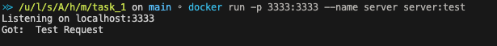

- 创建 tcp_client 镜像
- ```bash
  docker build -t client:test . -f Dockerfile_client 
  ```
- 创建 tcp_server 镜像
- ``` bash
  docke build -t server:test . -f Dockerfile_server
  ```
- 
- 运行 tcp_server 容器
- ```bash
  docker run -p 3333:3333 --name server server:test
  ```
- 
- 运行 tcp_client 容器
- ```bash
  docker run --network cotainer:server client:test
  ```
- 